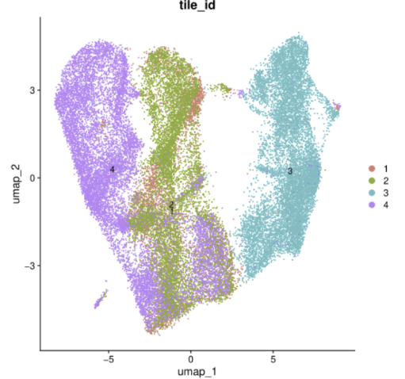
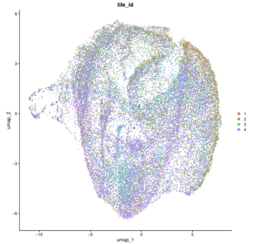
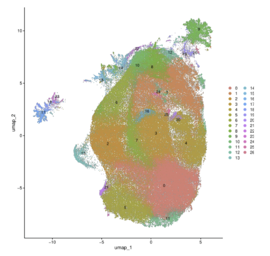

# SpatialBANKSY
Curio Seeker spatial transcriptomics data are high-dimensional and sparse, resulting in low signal-to-noise ratios for downstream analyses. To address this, this pipeline performs spatial binning of Curio Seeker data into grids, improving UMI counts while preserving and refining spatial structure through neighborhood-aware integration. 

The binned data are then processed with BANKSY ([GitHub](https://github.com/prabhakarlab/Banksy/blob/devel/README.md)), a neighborhood-based analysis method that integrates each bin's gene expression with that of its neighbors. BANKSY accounts for spatial relationships and context between each bin and enables the identification of coherent spatial domains, and supports downstream analyses such as clustering, marker identification, and spatial visualization.

## Pipeline Overview

The impact of spatial binning and neighborhood integration is reflected in how structure emerges across stages of the pipeline.

Before applying BANKSY, the embedding is largely driven by tile identity. Cells cluster strongly by spatial origin, indicating that positional or batch-related effects dominate the signal at this stage.



After spatial binning and BANKSY integration, this separation is reduced. The embedding becomes more mixed across tiles, suggesting that local neighborhood information has been incorporated and that the signal is no longer dominated by tile-specific effects.



This shift allows underlying transcriptional structure to emerge. When visualized without tile labels, the data resolves into more coherent clusters, reflecting spatially informed domains that are more suitable for downstream biological interpretation.



These steps transform sparse spatial transcriptomics data into a more stable and interpretable representation by reducing noise while preserving meaningful spatial relationships. From this point, the resulting clusters can be annotated to identify cell types or spatial domains for downstream biological interpretation.


## Dependencies
The pipeline was developed and tested in R using the following packages:
```
library(Seurat)
library(sf)
library(dplyr)
library(ggplot2)
library(patchwork)
library(SeuratData)
library(dbscan)
library(pheatmap)
library(clustree)
library(dplyr)
library(purrr)
library(clusterProfiler)
library(org.Mm.eg.db)
library(SeuratWrappers)
library(Banksy)
library(clusterProfiler)
```

